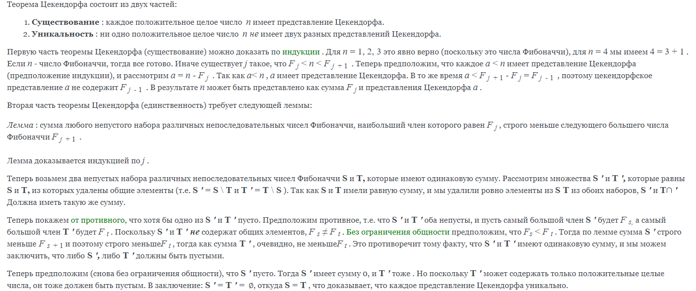
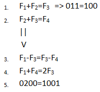
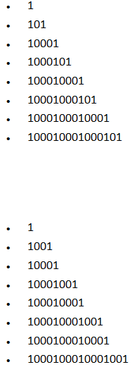

# Проект "Система счисления Фибоначчи"

---

## Исполнительная бригада:

> ♂boss of the git♂ - Коробов Артём

> ♂project boy♂ - Пузаков Артём

> Троицкий Макар

###### учащиеся первой группы десятого 'П' класса

---

### Цель проекта: создать/воссоздать/привнести что-то новое в систему счисления фибоначчи

* Доказательство существования нашей системы - теорема Цекендорфа:

  


* Перевод вовнутрь и вывнутрь системы - простая программка:
    ```python
    def _fib_val_from_dec(value):
        '''для корректного переведения числа в систему счисления Фибоначчи
        числа фибоначчи используются начина со второй единицы последовательности:
        0, 1, |1, 2, 3...'''
        sign = '+'
        if value == 0:
            return '0', sign
        elif value < 0:
            value = -value
            sign = '-'

        # случай, где value = 0, уже рассмотрен, а значит можно сразу написать как минимум одну единицу
        fib_val = '1'
        prev_fib_num, curr_fib_num = 1, 1
        while curr_fib_num + prev_fib_num <= value:
            prev_fib_num, curr_fib_num = curr_fib_num, prev_fib_num + curr_fib_num

        # "отрабатываем" ту самую единицу
        value -= curr_fib_num
        prev_fib_num, curr_fib_num = curr_fib_num - prev_fib_num, prev_fib_num

        while prev_fib_num != 0:
            if curr_fib_num <= value:
                value -= curr_fib_num
                if curr_fib_num - prev_fib_num != 0:
                    fib_val += '10'
                    prev_fib_num, curr_fib_num, = curr_fib_num - prev_fib_num, prev_fib_num
                else:
                    fib_val += '1'
            else:
                fib_val += '0'
            prev_fib_num, curr_fib_num, = curr_fib_num - prev_fib_num, prev_fib_num

        return fib_val, sign
  ```

* Поскаладывать и повычитать числа - пара формул:

  
  ###### сложение:
  ```python
    def _true_add(cls, value1, value2):
        '''сложение двух целых неотрицательных чисел в системе счисления фибоначчи.'''
        if len(value1) > len(value2):
            value1, value2 = value2, value1  # value1 должно быть меньше, чем value2
        res_value = value2[:len(value2) - len(value1)]
        for i in range(-len(value1), 0):
            res_value += str(int(value1[i]) + int(value2[i]))
        return cls._correct_fib_val(res_value)
    ```
  ###### вычитание:
    ```python
      def _true_sub(cls, value1, value2):
        sign = '+'
        if value2 > value1:
            value1, value2 = value2, value1  # value1 должно быть больше, чем value2
            sign = '-'

        res_val = list(map(int, value1))
        # при вычитании разность не будет содержать чисел, больше двойки,
        # а каждая двойка в нём будет окружена нулями
        for i in range(-1, -len(value2) - 1, -1):
            if value2[i] == '1':
                if res_val[i] == 0:
                    index = -res_val[i - 1::-1].index(1) + i - 1
                    res_val[index] = 0
                    for j in range(index + 1, i + 1, 2):
                        res_val[j] += 1
                    res_val[min(-1, j + 1)] += 1
                res_val[i] = 0

        return cls._correct_fib_val(''.join(map(str, res_val[res_val.index(1):]))), sign
    ```

* Возведение в квадрат и поразрядное умножение:

  
    ```python
    def _true_mul(cls, value1, value2):
        res_val = '0'
        for i in range(-len(value1), 0):
            if value1[i] == '1':
                for j in range(-len(value2), 0):
                    if value2[j] == '1':
                        index = -max(i, j) - 1
                        if i != j:
                            res_val = cls._true_add(res_val,
                                                    '1' + '0001' * (index // 2) + '001' * (index % 2) + '0' * (abs(i - j) - index%2))
                        else:
                            res_val = cls._true_add(res_val, '1' + '0001' * (index // 2) + '01' * (index % 2))
        return res_val
    ```

--- 

### Спасибо, что дочитали!

#### (если дочитали)

###### ♂slaves♂ хотят ♂three hundred♂ баллов
